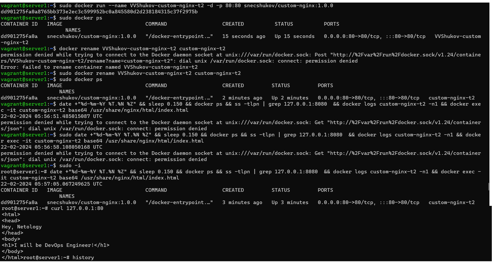
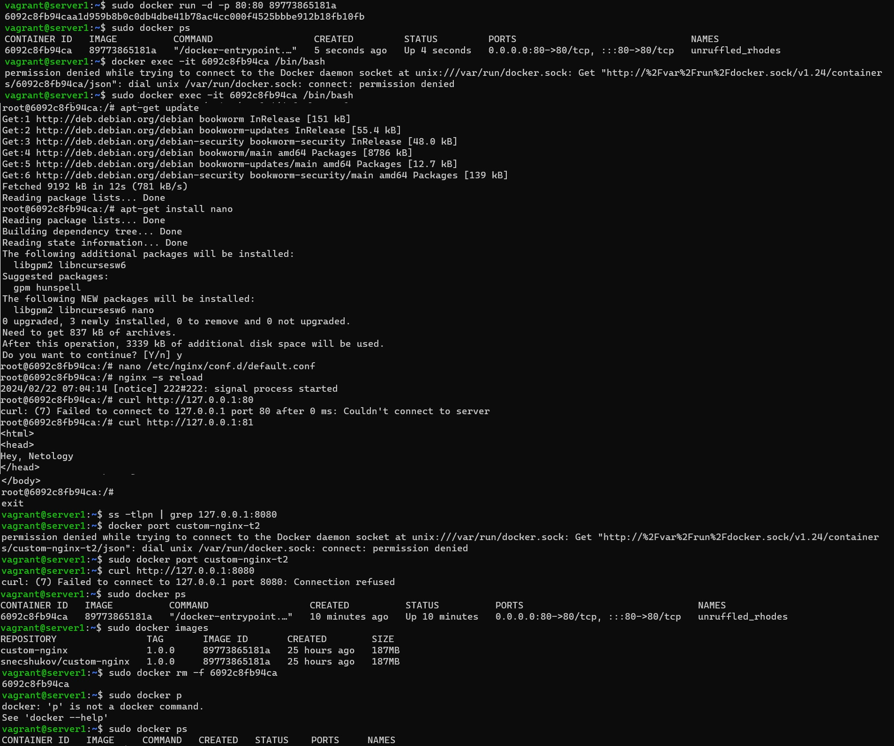
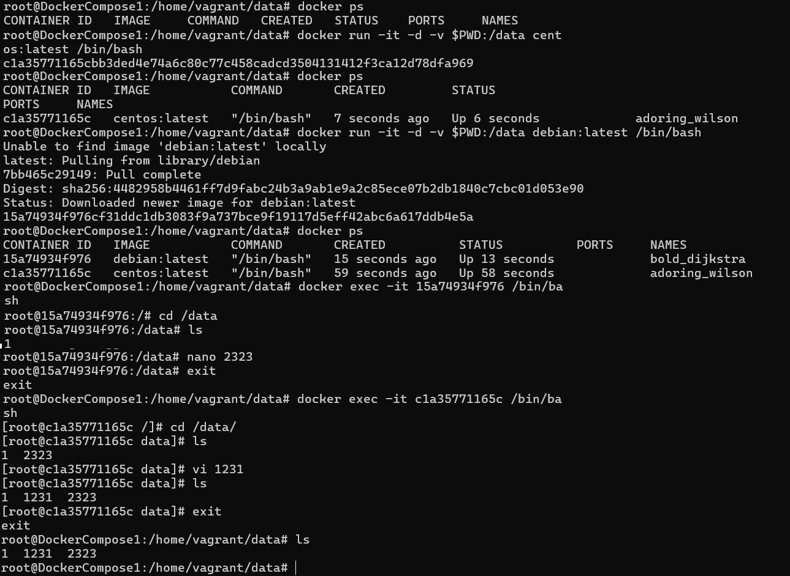
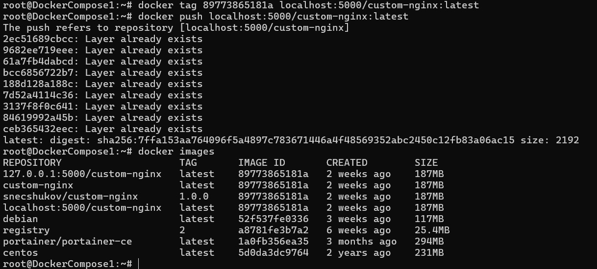
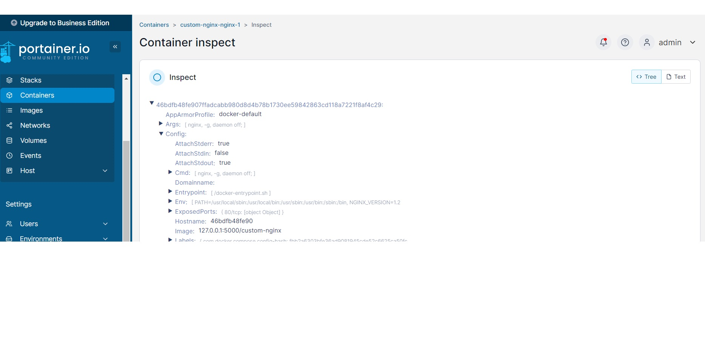

Задание 1
https://hub.docker.com/layers/snecshukov/custom-nginx/1.0.0/images/sha256-7ffa153aa764096f5a4897c783671446a4f48569352abc2450c12fb83a06ac15?tab=layers  
Задание 2

Задание 3  
	1. Непонятно почему выключается контейнер. Возможно потому что ctrl+c выключает единтвенный терминал  
	10-11. Проброс порта настроен с 80 на 80. В контейнере сервер повесили на 81 порт, на него проброс не включен. Что бы заработало, требуется запустить контейнер как -p 80:81
```bash
sudo docker commit a0e11d31d8f8
	sha256:364ccd7db7adfbc749bf36ce83503e3dcc1ee5942dc009a7d153ebe75c3115b7
	vagrant@server1:~$ sudo docker images
	REPOSITORY                TAG       IMAGE ID       CREATED         SIZE
	<none>                    <none>    364ccd7db7ad   8 seconds ago   208MB
	custom-nginx              1.0.0     89773865181a   5 days ago      187MB
	snecshukov/custom-nginx   1.0.0     89773865181a   5 days ago      187MB
	vagrant@server1:~$ sudo docker run -d -p 80:81 364ccd7db7ad
	f40d55340a8de2647df33bed9d7773ee87f39cdc636f8817c56f528fcb77e99c
	vagrant@server1:~$ curl http://127.0.0.1:80
	<html>
	<head>
	Hey, Netology
	</head>
	<body>
	<h1>I will be DevOps Engineer!</h1>
	</body>
```

Задание 4

Задание 5  
1-2. Если оба файла существуют, Compose предпочитает канонический compose.yaml
Но команда docker compose up -d, запустит именно docker-compose.yaml
		Что бы запускались оба, надо сделать конфиг docker-compose.yaml таким:
```y
version: "3"
		services:
		registry:
		image: registry:2
		network_mode: host
		ports:
			- "5000:5000"
		include:
			- compose.yaml
```
3.
  
7.Если удалить файл docker-compose.yaml и выполнить команду docker-compose up -d, то будет выведено предупреждение о том, что файл конфигурации не найден
выключить можно 
```
sudo docker compose down
```

